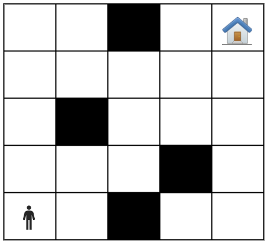

A NxN maze is given in which a person moves. In the maze there are walls placed at random positions and they cannot be jumped over. The person needs to reach the house without hitting any wall or going outside the maze. The person moves in four directions: up, down, left and right. In one move, the person can move right by two or three positions, while in all other directions they can move by only one position. An example of an initial state is shown in the following figure:

For all test cases, the board size n is read from standard input. Then the number of walls and the positions of each wall are read. At the end, the positions of the person and the house are read. Your task is to implement the movement of the person in the successor function. The actions are named “Right X/Up/Down/Left”. Then implement the heuristic function h. The problem needs to be solved in the minimum number of steps by applying informed search.

## Test Case 1
- Input: `5
4
2,0
3,1
1,2
2,4
0,0
4,4`
- Output: `['Up', 'Right 2', 'Up', 'Right 2', 'Up', 'Up']`

## Test Case 2
- Input: `6
16
1,1
1,2
1,3
1,4
2,1
2,2
2,3
2,4
3,1
3,2
3,3
3,4
4,1
4,2
4,3
4,4
0,5
5,5`
- Output: `['Right 3', 'Right 2']`

## Test Case 3
- Input: `3
1
1,0
0,0
2,0`
- Output: `['Up', 'Right 2', 'Down']`
