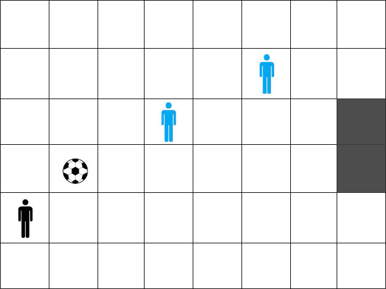

----------------------------------------------------

An 8x6 board is given, where a man and a ball are placed. The man needs to push the ball to the goal marked in gray. There are also opponents on the board marked in blue. The opponents are static and do not move.

The man can move in five directions: up, down, right, up-right and down-right by one position. When moving, if the ball is in front of him, he can push the ball in the direction in which he is moving. The man cannot be on the same field as the ball or any of the opponents. The ball also cannot be on a field that is adjacent to any of the opponents (horizontally, vertically or diagonally) or on the same field as any of the opponents.

Figure 1 shows one possible initial state of the board.

Figure 1:

For all test cases, the board size is the same, and the position of the man and the ball are changed and read from standard input. The position of the opponents and the goal is the same for all test cases. Your task is to implement the movement of the man (and thus the pushing of the ball) in the successor function. The actions are named as “Move man up/down/right/up-right/down-right” if the man is moved, or as “Push ball up/down/right/up-right/down-right” if the ball is also pushed when moving the man. Additionally, you need to check whether you have reached the goal, i.e. implement the goal_test function and check whether the condition is valid, i.e. add the check_valid function. You need to apply uninformed search to find a solution with the fewest number of steps.

### Test Case 1
- Input: `0,1
1,2`
- Output: `['Move man up', 'Move man up', 'Push ball down-right', 'Move man down', 'Push ball right', 'Push ball right', 'Push ball right', 'Move man down', 'Push ball up-right', 'Push ball up-right']`

### Test Case 2
- Input: `5,1
6,2`
- Output: `['Push ball up-right']`

### Test Case 3
- Input: `0,5
7,1`
- Output: `['Move man right', 'Move man right', 'Move man down-right', 'Move man down-right', 'Move man down-right', 'Move man down-right', 'Move man down-right', 'Push ball up']`