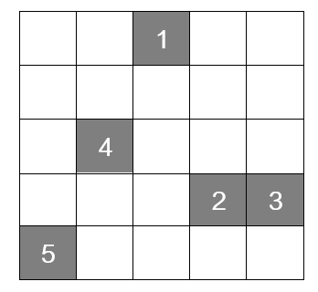
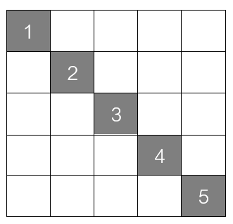

A 5x5 board is given, on which 5 gray squares are placed. Initially, the 5 squares are positioned at random locations on the board. Each square has an index number, which determines to which position on the left diagonal of the board that square needs to be moved. An example of an initial board state is shown in Figure 1, while Figure 2 shows the goal state of the board. Each square can be moved in four directions: up, down, left, and right by one position. In one move, only one square can be moved, and the square must not be moved outside the board, while multiple squares may occupy the same position.

Figure 1: 

Figure 2:

For all test cases, the board size is the same, while the positions of each of the squares are read from standard input. Your task is to implement the movement of the squares in the successor function, such that first the actions for moving the first square up, down, left, and right are tried, then for the second, third, fourth, and fifth square in that order. The actions are named “Move square X left/right/up/down”. The check whether a state is valid is already implemented with the function check_valid and can be used directly; you do not need to implement anything else. The problem state is stored in a tuple where the elements are the x and y positions of each square, ordered according to their index (the first position corresponds to square 1, the second to square 2, etc.). For example, the initial state in Figure 1 would be ((2, 4), (3, 1), (4, 1), (1, 2), (0, 0)).

### Test Case 1
- Input: `2,4
1,3
2,2
3,1
4,0`
- Output: `['Push ball up-right']`

### Test Case 2
- Input: `2,4
0,3
2,1
3,1
4,0`
- Output: `['Move square 1 left', 'Move square 1 left', 'Move square 2 right', 'Move square 3 up']`

### Test Case 3
- Input: `0,4
1,3
2,2
3,1
4,0`
- Output: `[]`