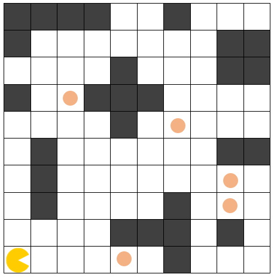
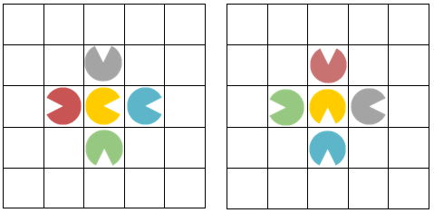

Propose a suitable representation of the Pacman game and write the necessary functions in Python to solve the following problem, for which one possible initial state is shown in **Figure 1**:

## Figure 1:

"On a 10x10 board there is a character. The character can move to any adjacent cell horizontally or vertically, provided that there is no obstacle in that position. The goal is for the character to eat all the dots placed on the board. At any moment, four movement actions are possible: move forward, move backward, turn left, and turn right. Figure 2 shows the possible movements of the character for two directions, where the new position obtained with the action move forward is marked in blue, move backward in red, turn left in gray, and turn right in green. The problem must be solved in the minimum number of moves."

## Figure 2:

or all test cases, the layout and size of the board are the same as in the example given in Figure 1. For all test cases, the positions of the obstacles are the same. For each test case, the initial position of the character changes, and the positions of the dots also change.

From standard input, the initial x and y coordinates of the character are read (if the board is viewed in the standard coordinate system). Next, the direction the player is facing is read (`'east'`, `'west'`, `'north'`, `'south'`). Then the number of dots on the board is read, after which in each new line the x and y coordinates of the dots are read (if the board is viewed in the standard coordinate system).

The movements of the character should be named as follows:

- **Move forward** – for moving the character one cell forward
- **Move backward** – for moving the character one cell backward
- **Turn left** – for moving the character one cell to the left
- **Turn right** – for moving the character one cell to the right

Your code should contain only one call to a function for output (`print`), which will return the sequence of moves that the character needs to perform in order to reach the position of the house from its initial position. You should apply uninformed search. Based on the test cases, you should determine which search method to use.

> **NOTE:** The order of actions in the successor function is important in uninformed search. Accordingly, to obtain the expected solution in the generated outputs, the order should be: Move forward, Move backward, Turn left, Turn right. If the actions are not ordered in the same way, it is possible to find an equally optimal solution with a different path.

### Test Case 1
- Input: `0
0
east
5
2,6
4,0
6,5
8,2
8,3`
- Output: `['Move forward', 'Move forward', 'Move forward', 'Move forward', 'Move backward', 'Move forward', 'Turn right', 'Move forward', 'Move forward', 'Move forward', 'Move forward', 'Move forward', 'Move backward', 'Move forward', 'Turn left', 'Move forward', 'Move forward', 'Move forward', 'Turn left', 'Move backward', 'Move forward', 'Turn left', 'Move forward', 'Turn right']`

### Test Case 2
- Input: `	
9
5
north
2
5,0
0,7`
- Output: `['Move forward', 'Turn left', 'Move forward', 'Move forward', 'Turn right', 'Move forward', 'Turn left', 'Move forward', 'Move forward', 'Move forward', 'Move forward', 'Turn left', 'Turn right', 'Move backward', 'Move forward', 'Turn right', 'Move forward', 'Move forward', 'Move forward', 'Move forward', 'Move forward', 'Move forward', 'Turn left', 'Move forward', 'Move forward']`

### Test Case 3
- Input: `4
3
north
10
2,3
3,3
5,3
6,3
7,3
8,3
9,3
9,2
8,2
7,2`
- Output: `['Turn left', 'Move forward', 'Move backward', 'Move forward', 'Move forward', 'Move forward', 'Move forward', 'Move forward', 'Move forward', 'Turn right', 'Turn right', 'Move forward']`