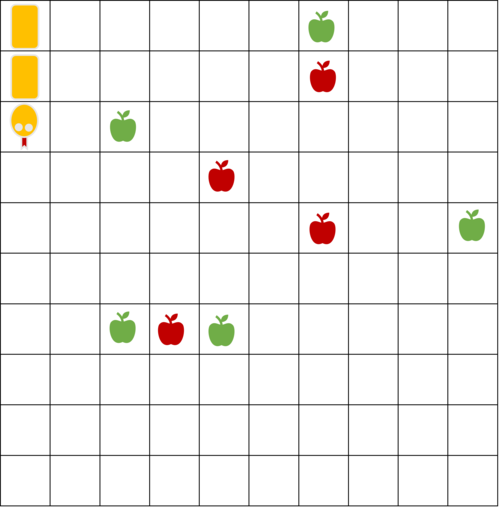
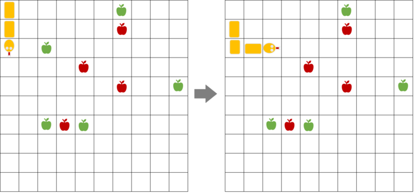

Propose a suitable representation and write the necessary functions in Python to solve the following problem, for which one possible initial state is shown in Figure 1:

**Figure 1:**

"On a 10x10 board there are a snake, green apples, and red apples. The snake needs to eat the green apples while avoiding the red apples, which are poisonous. Initially, the snake occupies three cells on the board, one cell for the head and two cells for the body. Each time a green apple is eaten, the body of the snake grows by one cell at the end (see Figure 2). At any moment, three movement actions are possible: move forward, turn left, and turn right. While moving, care must be taken so that the snake does not collide with itself (the head colliding with any part of the body) and does not move خارج the board. The problem must be solved in the minimum number of moves."

**Figure 2:**

For all test cases, the layout and size of the board are the same as in the example shown in the figure. For all test cases, the initial position of the snake is the same. For each test case, the number and initial positions of the green and red apples change.

In the provided starter code for the problem, the input arguments for each test case are read. The variable **crveni_jabolki** stores the positions of the red apples (as a list of tuples), and the variable **zeleni_jabolki** stores the positions of the green apples. The board is represented as a coordinate system with x and y coordinates starting from zero, so the positions are given as tuples where the first element is x and the second is y.

The movements of the snake should be named as follows:

- **Move forward** - the snake moves one cell forward
- **Turn right** - the snake moves one cell to the right
- **Turn left** - the snake moves one cell to the left

Your code should contain only one call to a function for output (print), which will return the sequence of moves that the snake needs to perform in order to eat all the green apples. The solution should be found with the minimum number of actions using an uninformed search algorithm. Based on the test cases, you should determine which search method to use.

### Test Case 1
- Input: `5
6,9
2,7
9,5
2,3
4,3
4
4,6
6,5
3,3
6,8`
- Output: `['Turn left', 'Move forward', 'Turn right', 'Move forward', 'Move forward', 'Move forward', 'Move forward', 'Turn left', 'Move forward', 'Turn left', 'Move forward', 'Turn right', 'Move forward', 'Move forward', 'Move forward', 'Move forward', 'Turn left', 'Move forward', 'Move forward', 'Move forward', 'Move forward', 'Turn left', 'Move forward', 'Move forward']`

### Test Case 2
- Input: `0
4
4,6
6,5
3,6
6,8`
- Output: `[]`

### Test Case 3
- Input: `6
3,7
4,7
5,7
5,5
3,5
3,9
5
3,8
4,6
0,6
1,6
2,6`
- Output: `['Turn left', 'Move forward', 'Move forward', 'Turn right', 'Move forward', 'Turn left', 'Move forward', 'Turn left', 'Move forward', 'Turn left', 'Turn right', 'Move forward', 'Turn left']`

