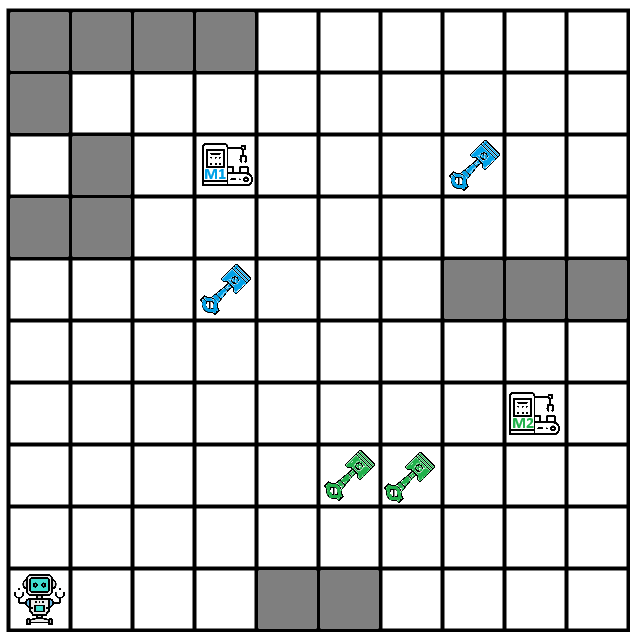

# Robot Grid Repair Problem

A 10×10 grid is given. On the grid, there is a robot, two machines **M1** and **M2**, and parts needed to repair each of the machines. The robot must collect the parts required to repair each machine, and then repair both machines. Some tiles on the grid are blocked by walls (gray-colored tiles), and the robot cannot step onto those tiles. The goal is reached when both machines have been repaired. An example initial state is shown in the image below.



The robot can move in 4 directions: `"Up"`, `"Down"`, `"Left"`, `"Right"`, or repair a machine (`"Repair"`).

Machine **M1** must be repaired first, and then machine **M2**. It is not allowed to collect parts for **M2** before **M1** has been repaired. The robot may be on the same tile as a machine even if it hasn't collected all the required parts, but it cannot repair the machine before collecting all its parts. It is also allowed to step onto a tile containing a part for **M2** before **M1** is repaired, but in that case, the part is not collected.

Repairing a machine takes a specific amount of time (number of steps). The robot must remain on the same tile and perform `s1` consecutive `"Repair"` actions to repair machine **M1**, and `s2` consecutive `"Repair"` actions to repair machine **M2**. The robot must move to the machine's tile and then begin the repair in the following step. If the robot starts the repair (the `"Repair"` action), but then moves to another tile before completing it, the repair must be started over.

Use uninformed search to find the shortest sequence of actions that allows the robot to repair both machines.

The directions can be defined using the following dictionary:


dir = {"Up": (0, -1), "Down": (0, 1), "Left": (-1, 0), "Right": (1, 0)}

For all test cases, the grid size and wall positions are the same. The input contains the following values: the robot's starting position x,y, the position of machine M1 given as m1_x, m1_y, the number of steps to repair M1 given as s1. The next lines contain the same information for M2: position m2_x, m2_y and number of steps s2 needed to repair M2. Then you're given the number of parts for M1 followed by their positions, and finally the number of parts for M2 followed by their positions.

Reading and initializing all input parameters, including wall positions, is handled in the starter code.

The input format is as follows:
``` python
x,y
m1_x,m1_y
s1
m2_x,m2_y
s2
e1
x11,y11
x12,y12
...
x_m1,y_m1
e2
x21,y21
x22,y22
...
x_m2,y_m2

```
### Test Case 1
- Input: `0,0
3,7
2
8,3
3
2
3,5
7,7
2
5,2
6,2`
- Output: `['Right', 'Right', 'Right', 'Up', 'Up', 'Up', 'Up', 'Up', 'Right', 'Right', 'Right', 'Up', 'Right', 'Up', 'Left', 'Left', 'Left', 'Left', 'Repair', 'Repair', 'Down', 'Down', 'Down', 'Down', 'Down', 'Right', 'Right', 'Right', 'Right', 'Right', 'Up', 'Repair', 'Repair', 'Repair']`

### Test Case 2
- Input: `9,9
8,9
2
5,9
1
2
9,8
8,8
2
7,9
6,9`
- Output: `['Down', 'Left', 'Up', 'Repair', 'Repair', 'Left', 'Left', 'Left', 'Repair']`

### Test Case 3
- Input: `6,5
6,5
2
8,8
3
1
5,4
1
8,7`
- Output: `['Down', 'Left', 'Right', 'Up', 'Repair', 'Repair', 'Up', 'Right', 'Right', 'Up', 'Up', 'Repair', 'Repair', 'Repair']`