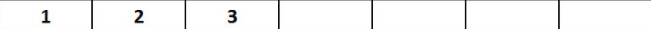
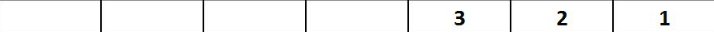

Propose a suitable representation and write the necessary functions in Python to solve the following problem, for which one possible initial state is shown in Figure 1.

"On a strip consisting of **L cells**, **N disks** are placed (**N < L**). The disks are all different and are numbered with integers from 1 to N. Initially, the disks are positioned in the first N cells of the strip (from left to right), arranged in increasing order according to their indices (Figure 1 – initial state for N = 3 and L = 7). The goal is to move the disks to the end of the strip (into the last N cells of the strip, from left to right), where they will be arranged in decreasing order according to their indices (as an example, Figure 2 shows the goal state corresponding to the initial state shown in Figure 1). In one move, a disk can be moved from its current cell to an adjacent empty cell (left or right). Also, a disk can be moved from its current cell -> over one cell (to the left or right), but only if the "jumped-over" cell contains another disk (for example, a disk can be moved from the first to the third cell only if the third cell is empty and the second cell contains another disk!). Disks are not allowed to move outside the strip. The problem must be solved in the minimum number of moves."

For all test cases, the layout of the strip is the same as in the example shown in the figures. For all test cases, the initial arrangement of the disks is the same (as described above). For each test case, the number of disks changes, as well as the length of the strip.

From standard input, the input arguments for each test case are read. First, the number of disks (**N**) is given, and then the length of the strip (**L**) is read.

The movements of the disks should be named as follows:

- **R1:** Disk i - for moving disk i one cell to the right into an adjacent empty cell, i = 1, 2, ..., N
- **R2:** Disk i - for moving disk i over one cell to the right, i = 1, 2, ..., N
- **L1:** Disk i - for moving disk i one cell to the left into an adjacent empty cell, i = 1, 2, ..., N
- **L2:** Disk i - for moving disk i over one cell to the left, i = 1, 2, ..., N

Your code should contain only one call to a function for output (print), which will return the sequence of moves needed to bring the disks to the required positions. You should apply uninformed search. Based on the test cases, you should determine which search method to use.

**NOTE:** The order of actions in the successor function is important in uninformed search. Accordingly, to obtain the expected solution in the generated outputs, the order should be R1, R2, L1, L2, for each cell on the strip sequentially, starting from the beginning. If the actions are not ordered in the same way, it is possible to find an equally optimal solution with a different path.

**Figure 1:**

**Figure 2:**

### Test Case 1
- Input: `3 7`
- Output: `['R2: Disk 2', 'R1: Disk 1', 'R2: Disk 3', 'R1: Disk 1', 'R2: Disk 2', 'L1: Disk 3', 'R2: Disk 1', 'R2: Disk 1', 'R1: Disk 3']`

### Test Case 2
- Input: `2 4`
- Output: `['R2: Disk 1', 'R1: Disk 1', 'R1: Disk 2']`

### Test Case 3
- Input: `5 6`
- Output: `['R2: Disk 4', 'R2: Disk 2', 'R1: Disk 1', 'L2: Disk 3', 'L2: Disk 5', 'L1: Disk 4', 'R2: Disk 2', 'R2: Disk 1', 'R1: Disk 3', 'L2: Disk 5', 'L2: Disk 4', 'L1: Disk 2', 'R2: Disk 1', 'R2: Disk 3', 'R1: Disk 5']`