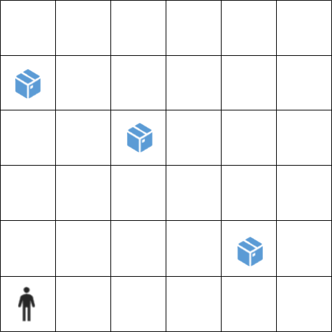

A board of size NxN is given, on which a person moves. On the board there are boxes placed at random positions. At the beginning, the person has a given number of balls m. The task is for the person to place all the balls into the boxes, such that each box contains exactly one ball. The person can place a ball into a box if they are located on a cell adjacent to the cell where the box is located. Diagonal cells are also considered adjacent. The person moves in two directions: up and right. The person must not step on a cell where a box is located and must not go outside the boundaries of the board. An example of an initial state is shown in the following image:

For all test cases, the size of the board n is read from standard input. Then, the number of boxes/balls and the position of each box are read. The initial position of the person is always (0, 0). Your task is to implement the movement of the person in the successor function. The actions are named "Gore/Desno". If there is no solution, it is necessary to print "No Solution!". The problem must be solved in the minimum number of steps by applying uninformed search.

### Test Case 1
- Input: `6
3
4,1
2,3
0,4`
- Output: `No Solution!`

### Test Case 2
- Input: `5
4
1,1
2,2
3,3
4,4`
- Output: `['Gore', 'Gore', 'Gore', 'Desno', 'Gore', 'Desno', 'Desno']`