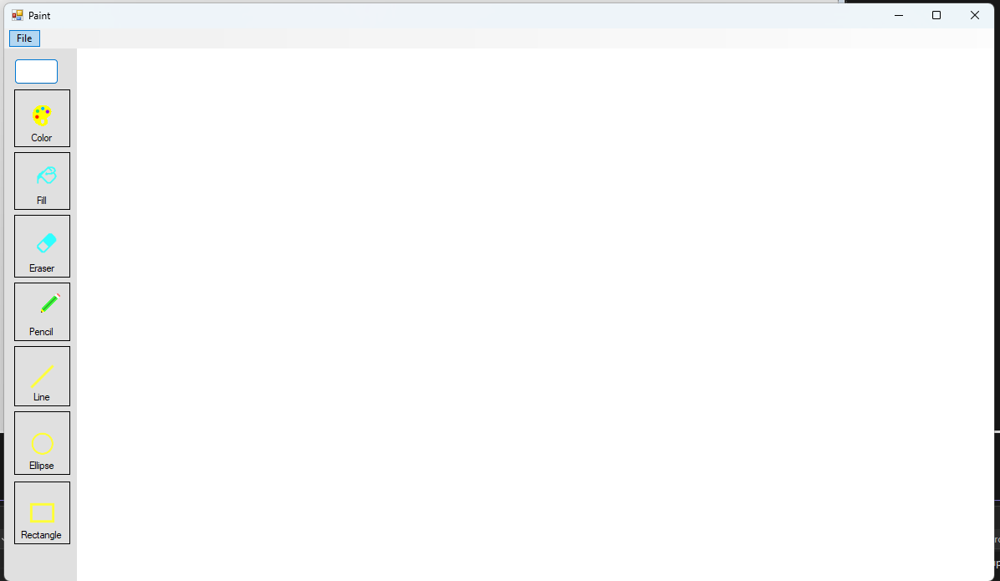

# 🎨 Paint Апликација — Windows Forms (C#)

Едноставна апликација за цртање слична на Microsoft Paint, изградена со C# и Windows Forms (.NET).

📋 Функционалности 

✏️ Молив — Рачно цртање на платното

🧹 Гумичка — Бришење делови од цртежот

🔴 Елипса — Цртање елипси 

🔲 Правоаголник — Цртање правоаголници 

📏 Линија — Цртање прави линии 

🪣 Пополнување — Flood-fill на област со избрана боја

🎨 Избор на боја — Избор на боја преку дијалог прозорец

💾 Зачувај — Извоз на платното како .jpg слика

📂 Отвори — Вчитување на постоечка .jpg / .jpeg слика

🆕 Ново — Бришење на платното и почеток од нула

---
⚙️ Технички белешки

Архитектура на платното

Површината за цртање е Bitmap објект зачуван во меморија и прикажан преку PictureBox контрола (pic). Постојан Graphics објект (canvasGraphics) го обвиткува bitmap-от и се користи за сите трајни операции на цртање во текот на животниот циклус на апликацијата.

Pipeline за цртање — Рачни алатки (Молив и Гумичка)

Рачните алатки работат со поврзување на последователни позиции на глувчето со кратки линиски сегменти, земени на секој MouseMove настан.

Pipeline за цртање — Алатки за форми (Елипса, Правоаголник, Линија)

Алатките за форми користат двофазен commit шаблон за поддршка на преглед во живо пред формата да биде финализирана:

Фаза 1 — Преглед (за време на влечење):

Настанот pic_Paint се активира на секој повик на pic.Refresh() (предизвикан внатре во MouseMove). Ја црта формата на привремен Graphics контекст обезбеден од paint настанот. Ова не се запишува на canvas bitmap-от, па исчезнува на следното репејнтување — создавајќи мазен преглед при влечење.

private void pic_Paint(object sender, PaintEventArgs e)

{

    if (isDrawing && selectedTool == 4)
    
        e.Graphics.DrawRectangle(drawingPen, originX, originY, startX, startY);
        
}

MouseDown → го поставува isDrawing = true, го зачувува previousPoint
MouseMove → црта линија од previousPoint до currentPoint, го ажурира previousPoint
MouseUp   → го поставува isDrawing = false
Молив користи drawingPen (боја избрана од корисникот, 1px ширина по default).
Гумичка користи eraserPen (бела боја, 20px ширина) за бојосување врз платното.
Двете алатки пишуваат директно во canvasGraphics, па промените се трајни на bitmap-от веднаш.

Фаза 2 — Commit (при MouseUp):

Кога копчето на глувчето се отпушта, финалната форма се црта на canvasGraphics (постојаниот bitmap), правејќи ја трајна.

Алгоритам за Flood Fill

Алатката за пополнување користи итеративен stack-based flood fill (4-насочен), избегнувајќи рекурзија за да спречи stack overflow на големи canvas области.

Чекори на алгоритмот:

Прочитај ја oldColor на кликнатиот пиксел.

Притисни го почетниот пиксел на Stack<Point>.

Извади пиксел, провери ги неговите 4 соседи (лево, горе, десно, долу).

---
# 🎨 Paint Апликација — Изглед

